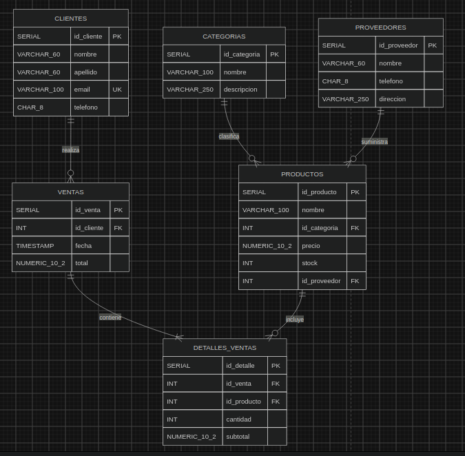

# Gestión de Inventario para la Tienda de Tecnología TechZone

Sistema de base de datos PostgreSQL para la gestión de inventario, clientes, ventas y proveedores de la tienda de tecnología **TechZone**.

## Estructura del Proyecto

```
database/
├── ddl/
│   └── schema.sql        # Creación de tablas (clientes, ventas, detalles_ventas, categorias, productos, proveedores)
├── dml/
│   └── inserts.sql       # Datos de ejemplo
└── dql/
    ├── queries.sql       # Consultas de análisis (productos con bajo stock, ventas, clientes frecuentes, etc.)
    └── procedures.sql    # Procedimiento almacenado para registrar ventas con transacciones
docs/
├── requirements..md      # Requerimientos del sistema
├── results.md            # Resultados
└── tables.png            # Diagrama de tablas
```

## Esquema de Base de Datos

- **clientes**: Información de los clientes (nombre, email, teléfono).
- **ventas**: Registro de ventas con fecha y total.
- **detalles_ventas**: Productos vendidos en cada venta (cantidad y subtotal).
- **categorias**: Clasificación de productos.
- **productos**: Productos con precio, stock y proveedor.
- **proveedores**: Proveedores de los productos.

## Consultas Incluidas

1. Productos con stock menor a 5 unidades.
2. Ventas totales de un mes específico.
3. Cliente con más compras realizadas.
4. Productos más vendidos.
5. Ventas en un rango de fechas.
6. Clientes que no han comprado en los últimos 6 meses.

## Diagrama
